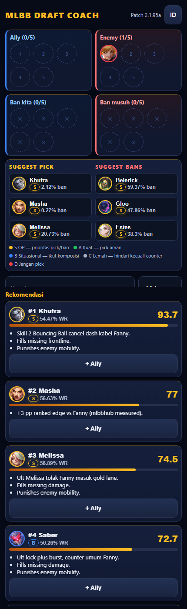

# MLBB Draft Coach

A Mobile Legends: Bang Bang draft assistant. Enter both teams' picks and bans, get ranked pick/ban
suggestions with a 0–100 score and a short explanation for each one.

Deterministic and explainable by design: every recommendation is a pure function of the JSON data in
`data/`, so the same draft always produces the same answer. No backend, no accounts, no AI in the
scoring loop.

<p align="center">
  
</p>

The screenshot above is a live run: Fanny locked in as the enemy jungler, and Khufra comes back at
93.7 — with Masha, Melissa, Saber and Kaja behind him.

## Features

- **5v5 draft board** — four lines (allies, enemies, our bans, enemy bans), five slots each. A hero
  can only live on one line; picking them elsewhere moves them.
- **Explained recommendations** — top 5 picks per draft, each with a score, a max of three reasons,
  and an expandable breakdown of the four scoring components.
- **Ban suggestions** — the same engine run from the enemy's perspective, then re-ranked by ban rate.
- **Draft warnings** — anti-synergy between your own allies, plus missing lanes, no frontline, no
  damage.
- **Meta context everywhere** — patch tier chip (S–D) and win rate on every hero, colour-coded rings
  on avatars, and a tier legend under the suggestions.
- **Indonesian / English toggle**, Indonesian by default.
- **Offline-capable** — all 133 hero icons are cached locally as WebP; nothing is hotlinked.
- **Mobile-first dark UI** — in-game blue-vs-red sides, gold accents, 44px touch targets, focus rings,
  `role=progressbar` score bars, and `prefers-reduced-motion` handling.

## How scoring works

`src/engine/score.ts` is pure — no fetching, no DOM. Every component normalises to 0–100.

| Component | Weight | Formula |
| --- | --- | --- |
| Counter | 0.50 | `clamp(avg_counter_score × 10 × (0.6 + 0.4 × coverage))` |
| Meta | 0.30 | `tier_score×10×0.5 + clamp((win_rate−45)×10)×0.3 + clamp(50 + impact×5)×0.2` |
| Comp | 0.15 | starts at 50, adjusted by the composition rules below |
| Mastery | 0.05 | defaults to 50 (neutral) |

- `coverage` is the share of enemy heroes this pick actually counters, so a hero who answers one of
  five enemies scores below one who answers three.
- Weights live in `src/engine/weights.json` and are validated to sum to 1.0 at load time.

Composition rules (`compScore`):

| Trigger | Adjustment |
| --- | --- |
| Team has no Tank/Frontline, candidate is one | +25 |
| Team has no Marksman/Mage/Assassin, candidate bursts ≥ 7 | +25 |
| Enemy has mobility and candidate has anti-dash/hard CC | +15 |
| Candidate's roles are fully covered by existing allies | −20 |
| Anti-synergy with an ally | − that relation's score |
| Synergy with an ally | + that relation's score |

The final score is `counter×0.5 + meta×0.3 + comp×0.15 + mastery×0.05`, clamped to 0–100.

Ban suggestions run `recommend()` with the two sides swapped, then add each candidate's ban rate and
take the top three. No separate ban logic exists.

## Data

Everything the engine reads sits in `data/` as flat JSON. There is no database and no server.

| File | Rows | Shape |
| --- | --- | --- |
| `data/heroes.json` | 133 | id, name, roles, lane, difficulty, 0–10 scores, tags, patch, icon |
| `data/counters.json` | 1498 | 503 `COUNTER` + 995 `COUNTERED_BY`, each with a reason and source URLs |
| `data/synergies.json` | 30 | 22 `SYNERGY` + 8 `ANTI_SYNERGY` |
| `data/meta.json` | 133 | one row per hero per patch: win/pick/ban rate, tier, tier_score |
| `data/patches.json` | 3 | buff/nerf entries with an impact value and an official source URL |
| `src/engine/weights.json` | — | the four scoring weights |

Current patch: **2.1.95a**. Tier spread: 12 S · 21 A · 41 B · 39 C · 20 D. Lanes: 34 Exp · 27 Roam ·
26 Mid · 25 Jungle · 21 Gold.

**Provenance is enforced, not decorative.** Counter rows carry `sources: string[]` and
`patch_verified`; the update scripts run every row through `isValidCounter()` / `isValidMeta()` and
drop anything with no source, a self-counter, a score out of range, or an impossible win rate. Where a
hand-written seed row and a scraped row disagree, the hand-written one wins. Where there is no
evidence at all, the hero is tagged `NoData` with neutral stats rather than given a guess — 112 of the
133 heroes are in that state today.

## Project structure

```
mlbb-draft/
  data/                     hero, counter, synergy, meta, patch JSON
  src/
    engine/
      types.ts              data contracts
      score.ts              counterScore / metaScore / compScore / finalScore (pure)
      recommend.ts          filter → score → sort → slice
      weights.json          scoring weights
    data/load.ts            loads JSON, validates weights and score ranges
    App.tsx                 the whole UI (draft board, filters, results)
    i18n.ts                 ID/EN strings
    index.css               theme tokens
  scripts/
    parse.mjs               pure parsers + validators (unit-tested)
    data-update.mjs         sync heroes + meta from mlbbhub
    counters-update.mjs     sync counter matchups
    cache-icons.mjs         download hero icons to public/icons
  tests/
    engine.test.ts          engine behaviour
    scripts.test.ts         parser regressions + data integrity guards
  public/icons/             133 local WebP icons
```

## Getting started

Requires Node 24+ and pnpm.

```bash
pnpm install
pnpm dev          # Vite dev server
pnpm build        # tsc -b && vite build
pnpm preview      # serve the production build
pnpm test         # vitest run
pnpm lint         # oxlint
```

The build is fully static — deploy `dist/` to any static host.

### Refreshing the data

```bash
pnpm data:update 2.1.96      # add newly released heroes, rewrite meta.json for all heroes
pnpm counters:update 2.1.96  # pull counter matchups for every hero
pnpm icons:cache <slug>      # cache specific hero icons locally
```

`data:update` scrapes mlbbhub for heroes that are missing from `heroes.json`, gives them neutral
stats and the `NoData` tag, and re-caches their icons. `counters:update` reads each hero's page for
measured `+pp` matchups (converted to a 0–10 score via `5 + pp`, capped) and strong-against entries,
never overwriting hand-written rows. Both scripts default to patch `2.1.95a` and write with
`JSON.stringify` on a single line.

These are one-off sync tools, not part of the build — the app itself never fetches anything.

## Tests

17 tests across two files, all green:

```bash
pnpm test
# Test Files  2 passed (2)
#      Tests  17 passed (17)
```

`tests/engine.test.ts` covers the engine's actual promises: Fanny as the enemy puts a Khufra/Kaja/
Franco-class counter in the top 3, a S-tier hero outranks a C-tier hero even with a weaker raw
counter, a missing tank outscores a redundant marksman on composition, picked and banned heroes are
excluded, and weights sum to 1 with all scores in 0–100.

`tests/scripts.test.ts` covers the parsers (including a regression test for hero names being scraped
from the breadcrumb instead of `<title>`) and guards the committed data: unique hero ids, every
counter reference resolving to a real hero, one meta row per hero, local icon paths, no self-counters,
no impossible win rates.

## Known limitations

- **Most heroes are still statless.** 112 of 133 carry the `NoData` tag: neutral 0–10 scores and zero
  counter relations. Their recommendations come from meta and composition alone.
- **Composition rules are static heuristics.** No role matrix per patch, so they under-perform what a
  pro drafter would read from a five-player composition.
- **Mastery is not wired to the UI.** The weight exists and the engine accepts a `mastery` map, but
  the interface always passes the neutral default of 50.
- **Community data, not official.** Counters and rates come from mlbbhub rather than Moonton's patch
  notes. `patches.json` is the only source intended to cite official URLs, and it has just 3 entries.
- **No persistence.** A draft lives in React state and vanishes on reload; there is no share link and
  no multi-user support.

## Roadmap

- Fill in counters and stat scores for the 112 `NoData` heroes.
- Surface mastery so the fifth weight actually does something.
- Replace the static composition rules with a per-patch role matrix.
- Optional AI narration on top of the deterministic reasons (never in the scoring path).

The full design rationale, data schema, scoring derivation and phase history live in
